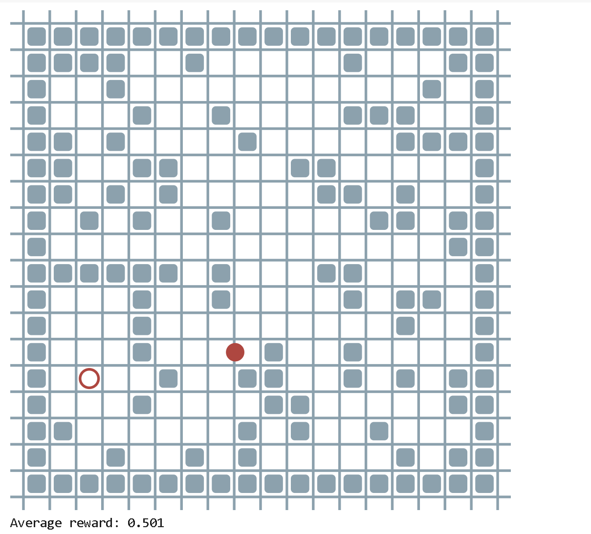

# POGEMA
В проекте решаем задачу навигации в частично-наблюдаемой среде. В качестве бейзлайна использовался DQN, который выдавал среднюю награду 0.501 при 10000 тестовых игр  
  

Мы исследовали зависимость средней награды от различных важных для DQN параметров, сравнили с double DQN. Также попробовали алгоритм PPO и его оптимизацию с помощью Optuna.  

Визуализация обучения в экспериментах выполнена с помощью tensorboard. Удалось увеличить среднюю награду до 0.7819 для базового DQN, до 0.7218 для Double DQN без настройки гиперпараметров, и до 0.7677 - для PPO  
Пример визуализации работы агента для PPO:

