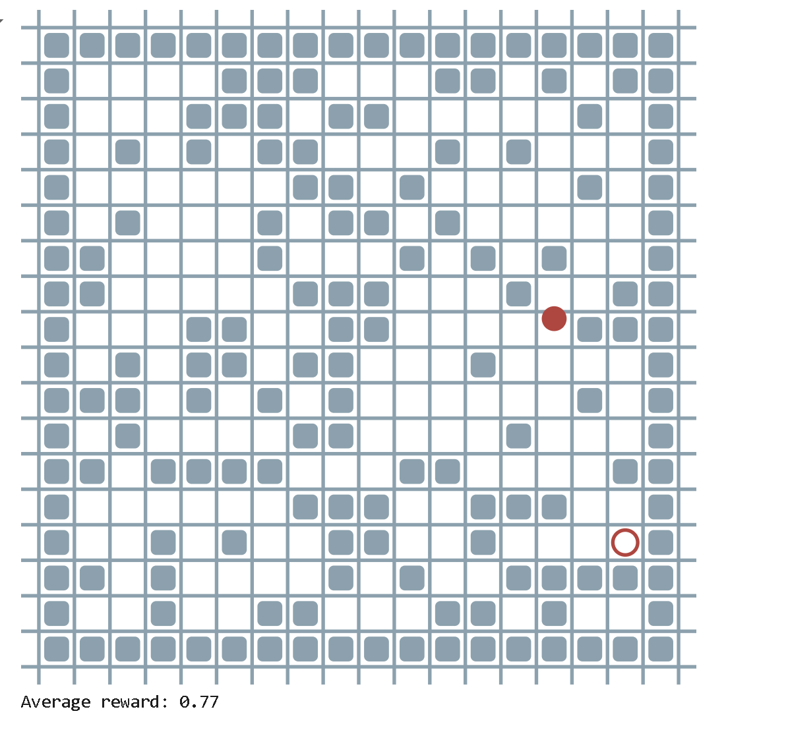
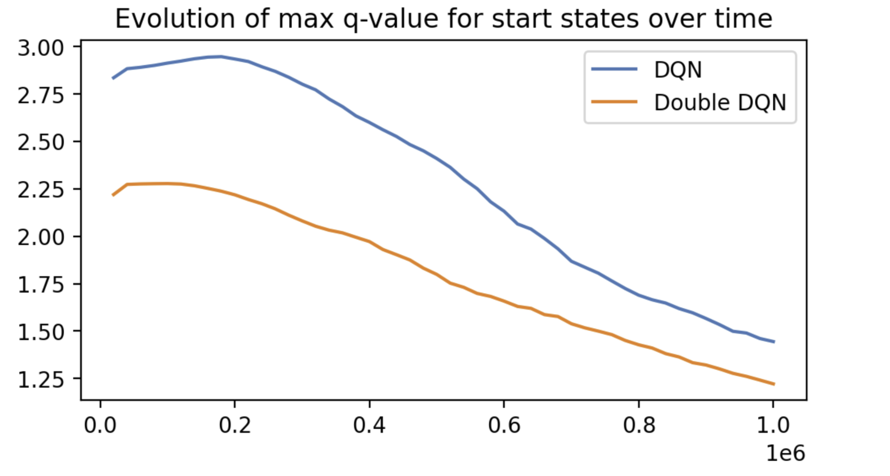
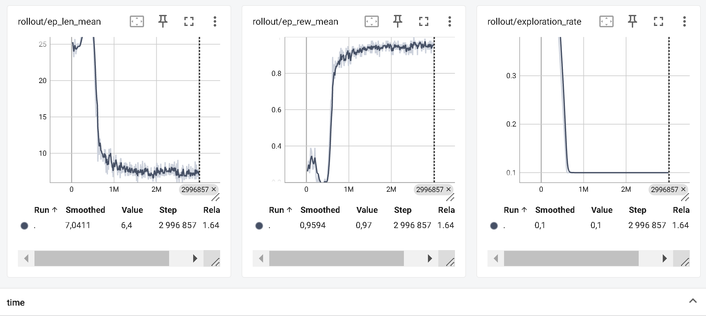

# POGEMA
В проекте осуществуляется оптимизация гиперпараметров для алгоритмов DQN c 1 агентом в среде POGEMA  

Для тюнинга гиперпараметров используется Grid-Search и Optuna  
Результаты алгоритма сравниваются с Double DQN и PPO  

Для визуализации построены дашборды по логам  

